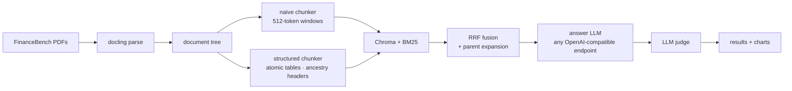
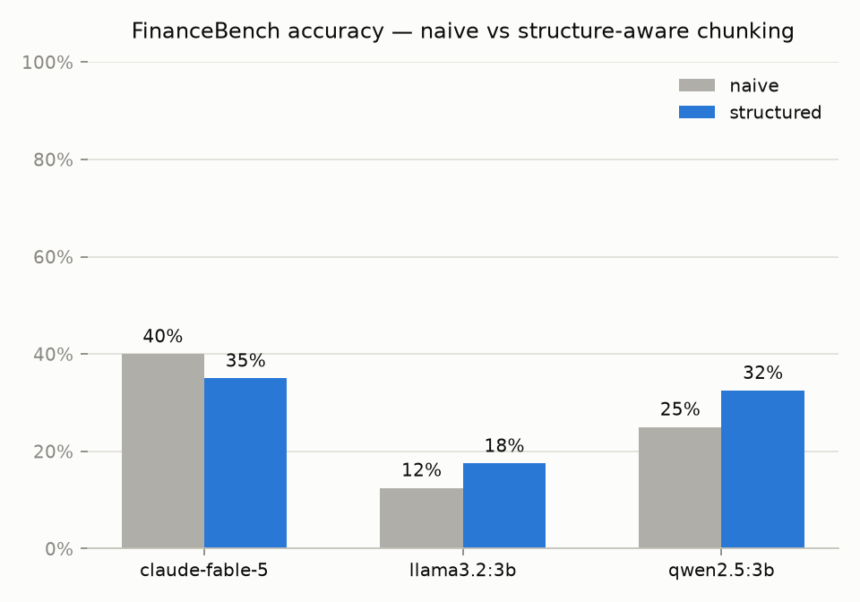
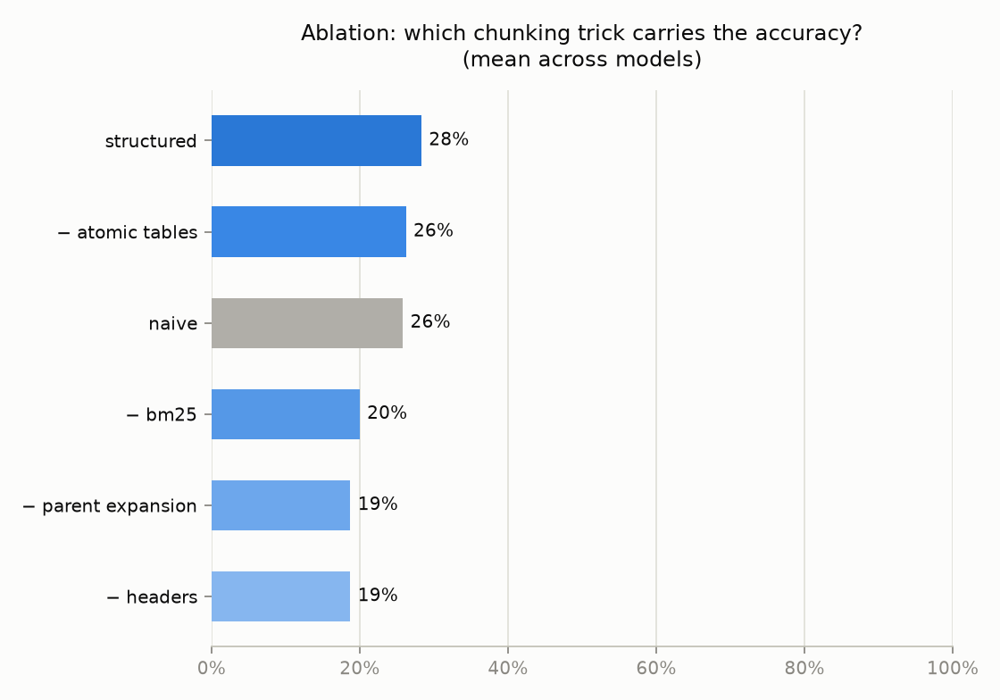

# finrag-chunking

**Structure-aware RAG for financial filings — with the benchmark to prove it.**

[](https://github.com/rchhabra13/finrag-chunking/actions/workflows/test.yml)


Generic 512-token chunking fails on SEC filings: it cuts balance sheets in
half, strips the fiscal-year lineage off every number, and drowns the retriever
in near-duplicate "revenue" chunks. This repo implements the structure-aware
chunking strategy from my article
[*RAG for Financial Docs Is Different*](https://medium.com/@rrchhabra) and
benchmarks it against the naive baseline on
[FinanceBench](https://github.com/patronus-ai/financebench) — across any model
behind an OpenAI-compatible endpoint (LM Studio, llama.cpp, Ollama locally;
OpenAI / Gemini / Anthropic compat endpoints for cloud).

## The four rules

1. **Parse structure before chunking.** Build a section tree (Item 1, Item 7,
   subsections…) from the PDF first; chunks never cross a section boundary.
2. **Tables are atomic.** One table = one chunk. Embed a summary of it; hand
   the model the full markdown table.
3. **Every chunk carries its ancestry.** `[Company | Filing | Section path |
   Type]` is prepended before embedding — the fiscal year is literally inside
   the vector.
4. **Embed small, retrieve big.** Small chunks are searched; their parent
   section (table intact, prose included) is what the LLM reads. Dense + BM25,
   fused with RRF.



## Results

Setup: 40 questions from the [FinanceBench open-source sample](https://github.com/patronus-ai/financebench)
(5 companies, 16 filings), answered by local models via Ollama, judged by
qwen2.5:3b against gold answers. Fully local, $0 in API costs.

| Model | Naive chunking | Structured chunking | Δ |
|---|---|---|---|
| llama3.2:3b | 12.5% | 17.5% | **+5.0 pts** |
| qwen2.5:3b | 25.0% | 32.5% | **+7.5 pts** |
| claude-fable-5 (in-chat) | 40.0% | 35.0% | −5.0 pts* |



Structure-aware chunking beats the naive baseline on both small local models.
(For calibration: the FinanceBench paper's GPT-4 + shared-vector-store
baseline scored ~19% — same ballpark as our naive runs.)

**\*The strong-model twist.** Claude Fable 5 answered the same 80
(question, retrieved-context) pairs — run in a Claude Code session over the
pipeline's exact contexts rather than via API, graded by the same qwen2.5:3b
judge. Its scores dwarf the 3B models on both strategies, but the
naive-vs-structured gap *disappears* (the −5 pt inversion is within noise:
on at least 4 questions the judge returned opposite verdicts for
near-identical answer texts, and n=40). Two honest observations survive the
noise: a strong reader can extract answers from raw, header-less naive table
fragments that sink a 3B model, so chunking quality matters most when the
answer model is weak; and naive contexts made Fable *abstain* more (14
"insufficient evidence" refusals vs 9 under structured) — structured
retrieval more often gave it enough evidence to attempt an answer. Each
strategy also won real retrieval head-to-heads the other lost (structured
found the cash-flow capex table; naive happened to contain the balance-sheet
PP&E line).

**My favorite failure.** Asked for Amcor's FY2023 revenue, the structured
pipeline answers *"$14,694 million"*. The naive pipeline answers
*"$14.694 million"* — off by three orders of magnitude, because its chunk
sliced the income statement away from the header that says *($ in millions)*.
That is the quietly-wrong failure mode this whole repo exists to kill.

### Ablations — which trick carries the points?

Full structured pipeline minus one trick at a time (mean over both models):

| Configuration | Accuracy | vs full structured |
|---|---|---|
| **structured (full)** | **25.0%** | — |
| − atomic tables | 26.3% | +1.3 |
| − BM25 hybrid | 20.0% | −5.0 |
| − ancestry headers | 18.8% | −6.2 |
| − parent expansion | 18.8% | −6.2 |
| naive baseline | 18.8% | −6.2 |



Removing **ancestry headers**, **parent expansion**, or **BM25** each drops
accuracy back to roughly the naive baseline — those three carry the gains at
this scale. **Atomic tables** measured neutral here, with a plausible
explanation: when a split table's fragments are retrieved, parent expansion
reassembles the surrounding section anyway, and 3B models are weak at reading
long markdown tables regardless of how intact they are. The article's claim
that atomic tables matter most was made with much stronger answer models —
re-running this matrix with bigger models is one `config.yaml` edit away.

**Honest caveats:** n=40, two 3B answer models, a 3B judge, single run. Treat
these as directional, not definitive. Your local runs store every raw answer
under `results/answers/` (kept out of git — FinanceBench data is CC BY-NC), so
you can re-judge with a stronger model (`finrag judge --model ...`) without
re-running generation — full tables in [results/results.md](results/results.md).

## Quickstart

```bash
git clone https://github.com/rchhabra13/finrag-chunking && cd finrag-chunking
uv sync

uv run finrag fetch     # FinanceBench questions + PDF subset (5 companies, 40 questions)
uv run finrag ingest    # parse -> chunk (all strategies) -> index   [slow: docling]

# start any local OpenAI-compatible server (LM Studio, ollama, llama.cpp), then:
uv run finrag models    # see what's live
uv run finrag eval --ablations
uv run finrag judge
uv run finrag report    # results/results.md + charts
```

Ask one-off questions:

```bash
uv run finrag ask "What was Amcor's FY2023 net income?" --doc AMCOR_2023_10K --show-context
```

## Adding models

Everything is an OpenAI-compatible endpoint in `config.yaml` — local servers
need no keys; cloud endpoints read keys from `.env` (see `.env.example`):

```yaml
llm:
  endpoints:
    - name: lmstudio
      base_url: http://localhost:1234/v1
      api_key: lm-studio
      models: []            # [] = auto-discover via GET /v1/models
    - name: openai
      base_url: https://api.openai.com/v1
      api_key_env: OPENAI_API_KEY
      models: [gpt-5-mini]
```

Answers are stored raw and judged in a separate pass — swap in a stronger
judge later (`finrag judge --model ...`) without re-running generation.

## Repo map

```
src/finrag/
├── parse/        docling PDF -> section tree (tables as atomic nodes)
├── chunk/        naive + structured chunkers, table summaries
├── index/        Chroma (bge-small) + BM25
├── retrieve.py   hybrid RRF + parent expansion
├── llm/          one client for every OpenAI-compatible endpoint
├── answer.py     cited answer generation
└── eval/         runner (resumable), judge (re-runnable), report (charts)
```

Details in [docs/architecture.md](docs/architecture.md).

## Limitations / phase 2

- Multi-hop questions (two filings + arithmetic) need decomposition + tools —
  next article.
- Docling heading detection is imperfect on exotic layouts; the tree degrades
  to flatter structure rather than failing.

## License

MIT
