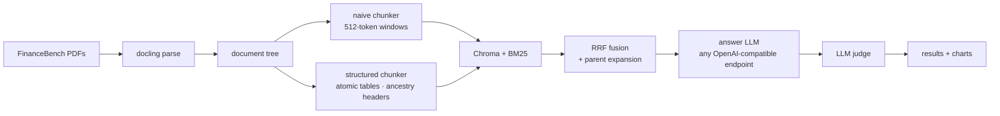

# finrag-chunking

**Structure-aware RAG for financial filings — with the benchmark to prove it.**

[](https://github.com/rchhabra13/finrag-chunking/actions/workflows/test.yml)


Generic 512-token chunking fails on SEC filings: it cuts balance sheets in
half, strips the fiscal-year lineage off every number, and drowns the retriever
in near-duplicate "revenue" chunks. This repo implements the structure-aware
chunking strategy from my article
[*RAG for Financial Docs Is Different*](https://medium.com/@rrchhabra) and
benchmarks it against the naive baseline on
[FinanceBench](https://github.com/patronus-ai/financebench) — across any model
behind an OpenAI-compatible endpoint (LM Studio, llama.cpp, Ollama locally;
OpenAI / Gemini / Anthropic compat endpoints for cloud).

## The four rules

1. **Parse structure before chunking.** Build a section tree (Item 1, Item 7,
   subsections…) from the PDF first; chunks never cross a section boundary.
2. **Tables are atomic.** One table = one chunk. Embed a summary of it; hand
   the model the full markdown table.
3. **Every chunk carries its ancestry.** `[Company | Filing | Section path |
   Type]` is prepended before embedding — the fiscal year is literally inside
   the vector.
4. **Embed small, retrieve big.** Small chunks are searched; their parent
   section (table intact, prose included) is what the LLM reads. Dense + BM25,
   fused with RRF.



## Results

> Benchmark in progress — table + charts land here.

## Quickstart

```bash
git clone https://github.com/rchhabra13/finrag-chunking && cd finrag-chunking
uv sync

uv run finrag fetch     # FinanceBench questions + PDF subset (5 companies, 40 questions)
uv run finrag ingest    # parse -> chunk (all strategies) -> index   [slow: docling]

# start any local OpenAI-compatible server (LM Studio, ollama, llama.cpp), then:
uv run finrag models    # see what's live
uv run finrag eval --ablations
uv run finrag judge
uv run finrag report    # results/results.md + charts
```

Ask one-off questions:

```bash
uv run finrag ask "What was Amcor's FY2023 net income?" --doc AMCOR_2023_10K --show-context
```

## Adding models

Everything is an OpenAI-compatible endpoint in `config.yaml` — local servers
need no keys; cloud endpoints read keys from `.env` (see `.env.example`):

```yaml
llm:
  endpoints:
    - name: lmstudio
      base_url: http://localhost:1234/v1
      api_key: lm-studio
      models: []            # [] = auto-discover via GET /v1/models
    - name: openai
      base_url: https://api.openai.com/v1
      api_key_env: OPENAI_API_KEY
      models: [gpt-5-mini]
```

Answers are stored raw and judged in a separate pass — swap in a stronger
judge later (`finrag judge --model ...`) without re-running generation.

## Repo map

```
src/finrag/
├── parse/        docling PDF -> section tree (tables as atomic nodes)
├── chunk/        naive + structured chunkers, table summaries
├── index/        Chroma (bge-small) + BM25
├── retrieve.py   hybrid RRF + parent expansion
├── llm/          one client for every OpenAI-compatible endpoint
├── answer.py     cited answer generation
└── eval/         runner (resumable), judge (re-runnable), report (charts)
```

Details in [docs/architecture.md](docs/architecture.md).

## Limitations / phase 2

- Multi-hop questions (two filings + arithmetic) need decomposition + tools —
  next article.
- Docling heading detection is imperfect on exotic layouts; the tree degrades
  to flatter structure rather than failing.

## License

MIT
